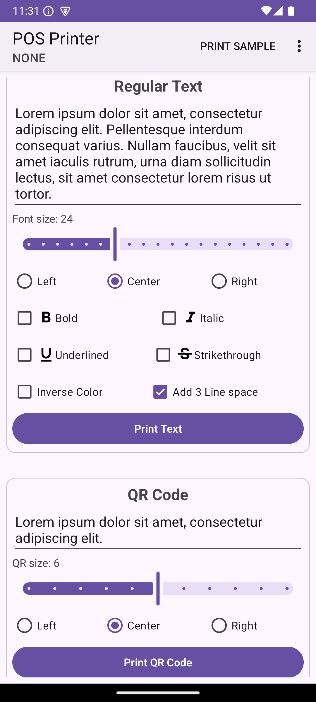
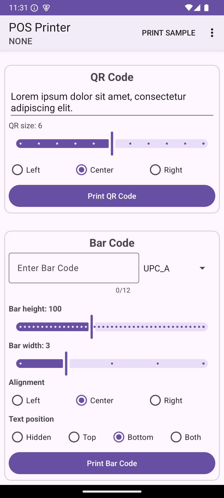
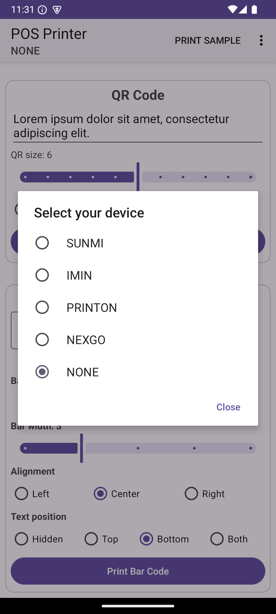

# POS Printer Library for Android

A versatile Android library for thermal receipt printers supporting multiple printer vendors.

## Supported Printer Vendors

- Sunmi
- iMin
- Printon
- Nexgo

## Features

### Print your formatted texts



### Print QR Code and Bar Code



### Change your printer vendor



## Installation

> **Note:** This library is not yet published to Maven Central or JitPack.

### Option 1: Add as a module dependency

1. Clone this repository:

   ```bash
   git clone https://github.com/yourusername/pos-printer.git
   ```

2. Copy the `printer` module to your project directory

3. Add the module to your project's `settings.gradle.kts`:

   ```kotlin
   include(":app", ":printer")
   ```

4. Add the dependency to your app's `build.gradle.kts`:
   ```kotlin
   implementation(project(":printer"))
   ```

### Option 2: Manual AAR integration

1. Clone this repository and build the project to generate AAR file
2. Copy the generated AAR file from `printer/build/outputs/aar/` to your project's `libs` folder
3. Add the dependency to your app's `build.gradle.kts`:
   ```kotlin
   implementation(files("libs/printer-release.aar"))
   ```

## Usage

Initialize the printer in your application:

```kotlin
Printer.initializePrinter(context)
```

Print text with formatting:

```kotlin
val textConfig = TextConfig(
    size = 24,
    printerAlignment = PrinterAlignment.CENTER,
    isBold = true
)
Printer.printText("Hello World!", textConfig)
```

Print QR Code:

```kotlin
Printer.printQRCode("https://example.com", QRCodeConfig())
```

Print Barcode:

```kotlin
Printer.printBarcode("1234567890", BarcodeConfig())
```

## License

This project is licensed under the MIT License - see the [LICENSE](LICENSE) file for details.

**Note on third-party SDKs:** This library incorporates SDKs from various printer vendors (Sunmi, iMin, Printon, Nexgo) which may be subject to different license terms. Users of this library are responsible for complying with the respective license terms of these third-party components. See the [LICENSE](LICENSE) file for more information.
